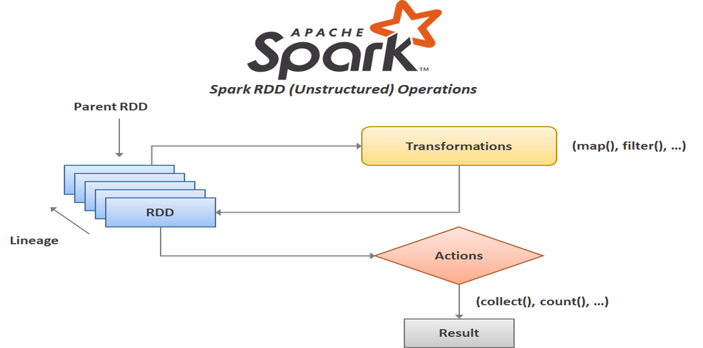
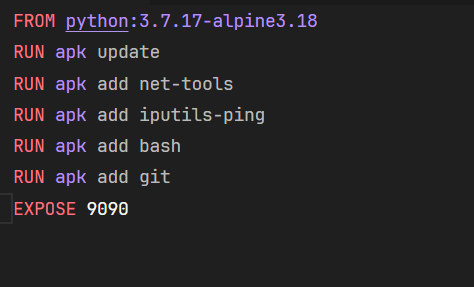
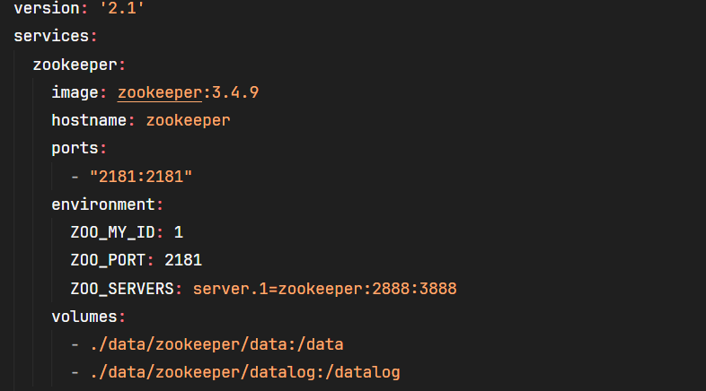

# Ferramenta BigData apache Spark em Docker

## Requisitos funcionais

- Docker na versão 4.23.0 ou na versão mais recente [https://www.docker.com/products/docker-desktop/]

- Git na versão 2.39.1 ou na versão mais recente [https://git-scm.com/download/win]

- Imagem apache spark na versão mais recente [https://hub.docker.com/r/bitnami/spark]

### Ambiente de desenvolvimento integrado (IDE)

- Recomendo o uso do VSCode na versão mais recente.

### Sistema Operacional (SO)

- O projeto foi testado e é compátivel com Windows e Linux.

## Requisitos Não funcionais

### Conhecimentos necessários

- Docker: Conhecimento básico é necessário .
- Apache spark: Conhecimento básico é recomendado.
- Python: Conhecimento básico é recomendado.
- Pyspark: Conhecimento básico é recomendado.
- Git: Conhecimento básico é recomendado.

## Conceitos iniciais

### Apache spark

O Apache Spark é uma plataforma de computação distribuída de código aberto projetada para processamento de dados em larga escala e análise avançada em ambientes distribuídos. Ele oferece uma variedade de APIs em várias linguagens de programação, incluindo Scala, Java, Python e SQL, permitindo que os desenvolvedores escrevam programas de forma fácil e expressiva.

Uma das principais características do Spark é sua capacidade de executar tarefas em memória, o que resulta em um processamento de dados muito mais rápido do que sistemas tradicionais de processamento em disco. Ele fornece suporte para uma ampla gama de cargas de trabalho, incluindo processamento em lote, streaming de dados em tempo real, aprendizado de máquina e processamento de gráficos.

### Conceitos de Streaming processing

- Na camada de streaming, os dados são processados continuamente à medida que são recebidos, em vez de serem processados em lotes estáticos.
- Os dados são frequentemente transmitidos em pequenos lotes ou como um fluxo contínuo e são processados em tempo real à medida que chegam.
- Essa abordagem é especialmente útil em cenários em que a latência é crítica e as respostas precisam ser fornecidas em tempo real, como em sistemas de monitoramento em tempo real, análise de feeds de redes sociais, processamento de eventos de IoT (Internet das Coisas), entre outros.

### Conceitos de Batch processing

- Na camada de lote, os dados são processados em lotes estáticos, ou seja, uma grande quantidade de dados é coletada e processada de uma só vez.
- Os dados geralmente são armazenados em um local centralizado (como um data lake ou um sistema de arquivos distribuído) e são processados em intervalos regulares.
- Essa abordagem é adequada para cenários em que a latência não é crítica e o processamento pode ser feito de forma mais eficiente em grandes volumes de dados.
- Exemplos de casos de uso incluem análise de dados históricos, geração de relatórios, processamento de dados de logs, entre outros.

### Resilient Distributed Datasets (RDDs)

- RDDs são a principal abstração de dados no Apache Spark.
- Um RDD é uma coleção imutável e distribuída de objetos que podem ser processados em paralelo.
- Os RDDs suportam operações de transformação (que criam um novo RDD a partir de um existente) e operações de ação (que retornam resultados para o driver do Spark).
- Escrito em Java/Scala
- High Level API (Python(pyspark),C#, R) -> Traduzindo -> Low Level API(Java/Scala)
- High Level API = Dataframe API
- Low Level API = RDDs

### Componentes do apache Spark

- Spark Core: Este é o componente principal do Apache Spark e fornece funcionalidades básicas para processamento distribuído, incluindo suporte para RDDs (Resilient Distributed Datasets), operações de transformação e ação, escalabilidade e tolerância a falhas.

- Spark SQL: Este componente permite que os usuários executem consultas SQL em RDDs, DataFrames e tabelas temporárias. Ele fornece uma interface de programação familiar para processamento de dados estruturados e semi-estruturados, facilitando a integração do Spark com ferramentas e habilidades SQL existentes.

- Spark Streaming: Este componente permite o processamento em tempo real de streams de dados. Ele oferece suporte a fontes de dados como Kafka, Flume, Kinesis, entre outros, e permite aplicar operações de transformação e análise em tempo real nos dados recebidos.

- Spark MLlib: Esta é uma biblioteca de aprendizado de máquina do Apache Spark que fornece algoritmos e utilitários para treinamento e implantação de modelos de machine learning em escala. Ele inclui algoritmos para classificação, regressão, clustering, recomendação, entre outros.

- Spark GraphX: Este componente fornece uma API para processamento de grafos e análise de dados de grafo no Apache Spark. Ele inclui algoritmos para calcular métricas de grafos, realizar consultas de grafos e executar análises de comunidades, entre outras funcionalidades.

- PySpark: Esta é uma interface Python para o Apache Spark que permite aos usuários interagir com o Spark usando a linguagem de programação Python. Ele fornece funcionalidades semelhantes ao SparkR para manipulação de dados, análise estatística e construção de modelos de machine learning em Python.

### Docker

O Docker é uma plataforma de código aberto que permite a criação, implantação e execução de aplicativos em contêineres. Os contêineres são unidades de software leves e isoladas que encapsulam todos os componentes necessários para que um aplicativo seja executado, incluindo o código, as bibliotecas e as dependências. Isso proporciona consistência no ambiente de desenvolvimento, teste e produção, garantindo que o aplicativo funcione da mesma forma em diferentes ambientes.

Além disso, o Docker facilita a implantação e o gerenciamento de aplicativos, permitindo que os desenvolvedores construam, compartilhem e executem aplicativos de forma rápida e eficiente, independentemente do ambiente de hospedagem.

### Arquivos necessários para criar um contêiner:

- Dockerfile: Arquivo de texto que contém instruções sobre como construir uma imagem Docker, descrevendo os passos necessários para criar uma imagem a partir de uma imagem base, instalando dependências, copiando arquivos, configurando variáveis de ambiente, entre outros.

Exemplo de Dockerfile:

- docker-compose.yml: é usado para definir e executar serviços em vários contêineres Docker. Ele permite definir a configuração de vários contêineres em um único arquivo, incluindo a imagem a ser usada, portas expostas, variáveis de ambiente, volumes montados, entre outros.

Exemplo docker-compose.yml:

### Referências
Introdução ao Spark com PySpark: [https://sol.sbc.org.br/livros/index.php/sbc/catalog/download/80/346/605?inline=1#:~:text=O%20conjunto%20de%20dados%20resilientes,do%20RDD%20em%20diferentes%20partições.]

