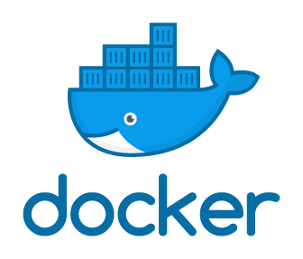

# Ferramenta BigData apache Spark em Docker

## Requisitos funcionais

- Docker na versão 4.23.0 ou na ultima versão mais recente [https://www.docker.com/products/docker-desktop/]

- Git na versão 2.39.1 ou na ultima versão mais recente [https://git-scm.com/download/win]

- Imagem apache spark na ultima versão mais recente [https://hub.docker.com/r/bitnami/spark]

### Ambiente de desenvolvimento integrado (IDE)

- Recomendo o uso do VSCodena ultima versão mais recente.

### Sistema Operacional (SO)

- O projeto foi testado e é compátivel com Windows e Linux.

## Requisitos Não funcionais

### Conhecimentos necessários

- Docker: Conhecimento básico é recomendado.
- Apache spark: Conhecimento básico é recomendado.
- Python: Conhecimento básico é recomendado.
- Git: Conhecimento básico é recomendado.

## Conceitos iniciais

### Conceitos de Streaming

- Na camada de streaming, os dados são processados continuamente à medida que são recebidos, em vez de serem processados em lotes estáticos.
- Os dados são frequentemente transmitidos em pequenos lotes ou como um fluxo contínuo e são processados em tempo real à medida que chegam.
- Essa abordagem é especialmente útil em cenários em que a latência é crítica e as respostas precisam ser fornecidas em tempo real, como em sistemas de monitoramento em tempo real, análise de feeds de redes sociais, processamento de eventos de IoT (Internet das Coisas), entre outros.

### Conceitos de Batch

- Na camada de lote, os dados são processados em lotes estáticos, ou seja, uma grande quantidade de dados é coletada e processada de uma só vez.
- Os dados geralmente são armazenados em um local centralizado (como um data lake ou um sistema de arquivos distribuído) e são processados em intervalos regulares.
- Essa abordagem é adequada para cenários em que a latência não é crítica e o processamento pode ser feito de forma mais eficiente em grandes volumes de dados.
- Exemplos de casos de uso incluem análise de dados históricos, geração de relatórios, processamento de dados de logs, entre outros.

### Apache spark

O Apache Spark é uma plataforma de computação distribuída de código aberto projetada para processamento de dados em larga escala e análise avançada em ambientes distribuídos. Ele oferece uma variedade de APIs em várias linguagens de programação, incluindo Scala, Java, Python e SQL, permitindo que os desenvolvedores escrevam programas de forma fácil e expressiva.

Uma das principais características do Spark é sua capacidade de executar tarefas em memória, o que resulta em um processamento de dados muito mais rápido do que sistemas tradicionais de processamento em disco. Ele fornece suporte para uma ampla gama de cargas de trabalho, incluindo processamento em lote, streaming de dados em tempo real, aprendizado de máquina e processamento de gráficos.

### Docker

O Docker é uma plataforma de código aberto que permite a criação, implantação e execução de aplicativos em contêineres. Os contêineres são unidades de software leves e isoladas que encapsulam todos os componentes necessários para que um aplicativo seja executado, incluindo o código, as bibliotecas e as dependências. Isso proporciona consistência no ambiente de desenvolvimento, teste e produção, garantindo que o aplicativo funcione da mesma forma em diferentes ambientes.

Além disso, o Docker facilita a implantação e o gerenciamento de aplicativos, permitindo que os desenvolvedores construam, compartilhem e executem aplicativos de forma rápida e eficiente, independentemente do ambiente de hospedagem.

### Arquivos necessários para criar um contêiner:

- Dockerfile: Arquivo de texto que contém instruções sobre como construir uma imagem Docker, descrevendo os passos necessários para criar uma imagem a partir de uma imagem base, instalando dependências, copiando arquivos, configurando variáveis de ambiente, entre outros.
